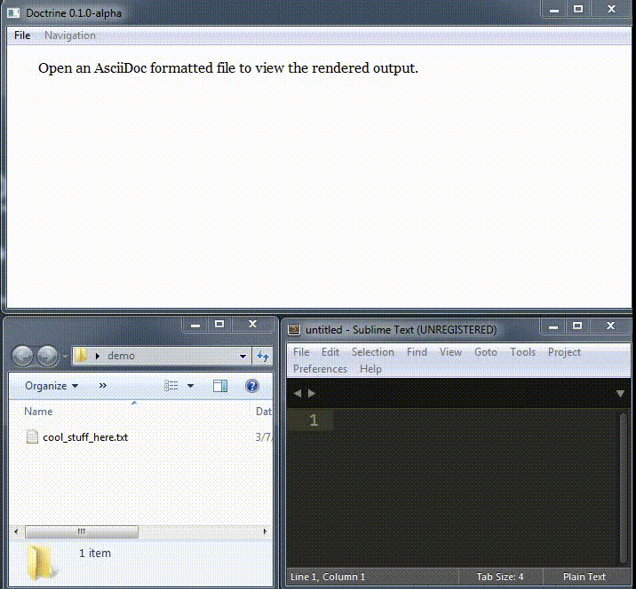

Doctrine
========

Doctrine is a GUI utility for quickly and easily viewing rendered markup. Currently only [AsciiDoc](http://asciidoc.org/) is supported but additional formats (Markdown, reStructuredText, etc) are planned for future versions.

## Goals
Viewing markup documents should be easy! The primary goal of Doctrine is to provide an all-in-one software application that saves the user from common, repetitious tasks while working with markup formats. No need to install command-line tools (e.g. `asciidoc`, `asciidoctor`, `pandoc`, etc), manually render to a temporary HTML file and then view the file in a browser, Doctrine will handle that for you!

## Status
The current status is **alpha development**. For now the software is largely a proof-of-concept but it is functional.

This project is targeting Windows during alpha development. Porting to other platforms is planned for future versions.

## Installation
The plan is to release Doctrine as a stand-alone executable (e.g. `doctrine.exe` on Windows). The only installation required would be to copy the executable to a directory.

The source for Doctrine can be ran if the following required items are installed:

  - Python 2.7
  - PySide 1.2.2

## Usage
To view a document, simply open it in Doctrine. The markup will be rendered to a temporary file which will be deleted either upon exiting Doctrine or when another document is opened.

If the markup file is modified while open in Doctrine, it can be manually reloaded (e.g. by pressing `F5`) to display the changes.

All local relative links should function properly (e.g. images, other markup files). Links to websites will be opened in the default browser.

The following document file types are supported:

  - AsciiDoc (`*.txt`, `*.ad`, `*.adoc`, `*.asciidoc`) - Text file formatted using [AsciiDoc](http://asciidoc.org/) markup.
  - Zip File (`*.zip`) - If the zip file contains a root `__archive_info__.txt` file (check out [Archiver](https://github.com/jeffrimko/Archiver)), that file will be rendered as AsciiDoc. Otherwise, the first valid markup file found will be rendered. Relative links to assets in the zip file should work.

## Demo
The following is a simple example of rendering an AsciiDoc file with Doctrine.

## Final Thoughts
Big thanks to [Stuart Rackham](http://www.methods.co.nz/stuart.html) for developing the excellent AsciiDoc format.

Additional details on this project are available at [jeffcomput.es/projects/doctrine](http://jeffcomput.es/projects/doctrine).
